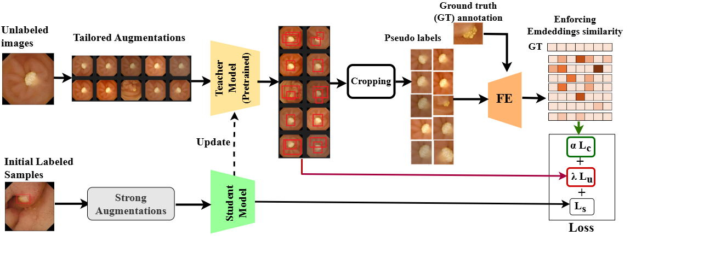
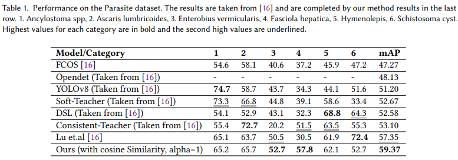
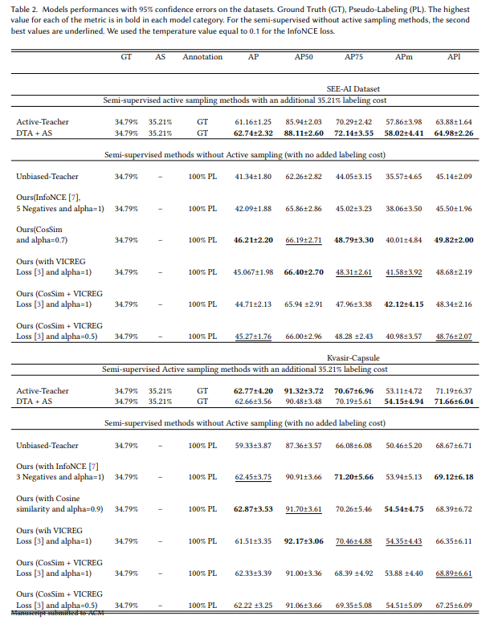
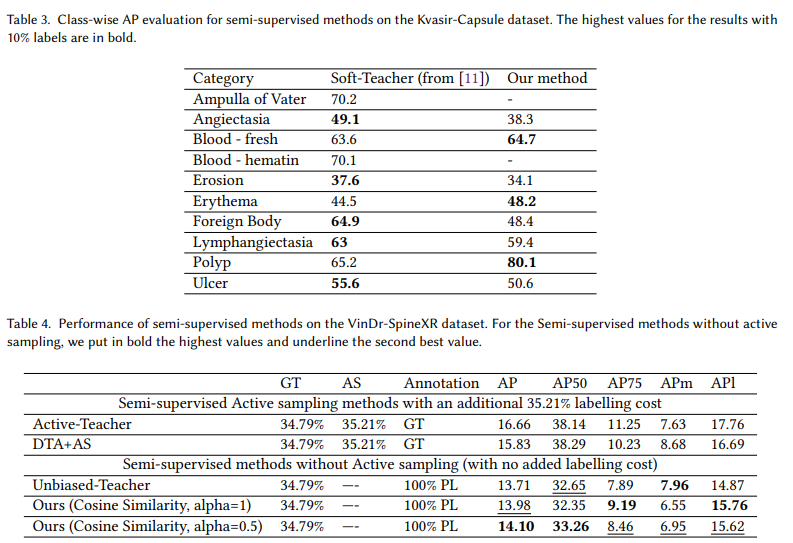
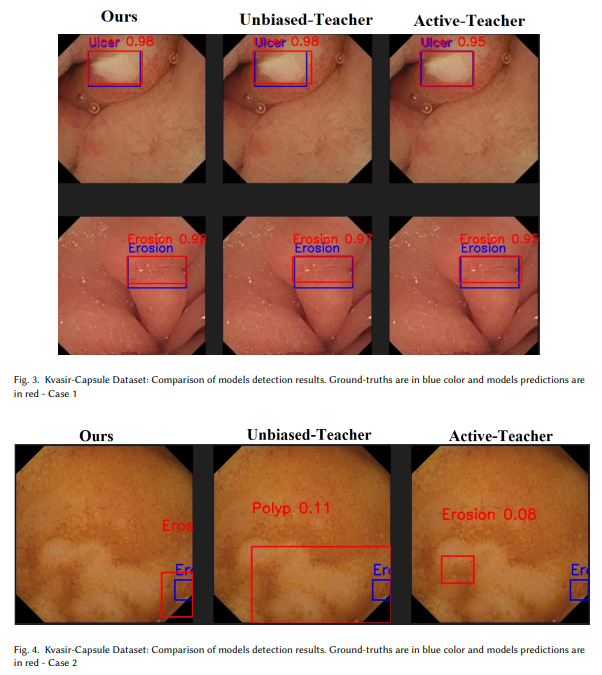
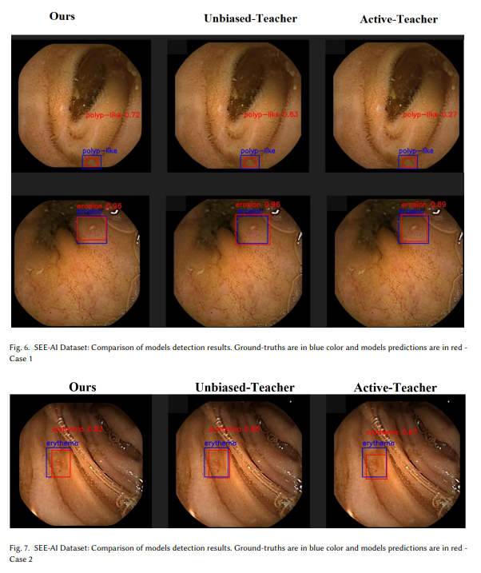

# Improving pseudo-labels using the embeddings for semi-supervised pathology detection in Capsule Endoscopy
This is an official implementation for ACM2025 paper ["Improving pseudo-labels using the embeddings for semi-supervised pathology
detection in Capsule Endoscopy"]([https://xxxx.pdf](https://github.com/agossouema2011/SSL_Emb_Similarity)). 


## Introduction

The overall of our **Bloc Diagram**. 
<p align="center">

  Fig. 1: Block diagram of our proposed method. DTA provides of image transformations that commonly occur in WCE. Each unlabeled image is augmented by DTA, which generates multiples augmented versions. The pretrained teacher generates predictions for the augmented versions. The bounding boxes are then fused using Weighted Boxes Fusion (WBF) to refine initial predictions. DTA and WBF enable our method to take into account uncertainty in the final predictions before actively sampling the most informative unlabeled images using the work by Mi et al.[Active teacher].


</p>

## Installation

- Install **detectron2** following the [instructions](https://detectron2.readthedocs.io/tutorials/install.html).

## Important notes
- Update "NUM_CLASSES: 8" in 'configs/coco/Base-RCNN-FPN.yaml' to fit the number of class of your dataset.
- You can also update other parameters in the configuration file 'configs/coco/Base-RCNN-FPN.yaml' or 'configs/Base-RCNN-FPN.yaml'
- Update "metadata" variable in 'tools/train_net.py' and 'tools/train_net_sets.py' according to the classes names of your dataset
  
## Dataset Preparation

### Custom dataset
Download our folder containing the two datasets (Kvasir Capsule and SEE-AI) we used here :[Kvasir Capsule](https://www.kaggle.com/datasets/emmanuelagosou/our-samples-from-kvasir-capsule-dataset) and [SEE-AI](https://www.kaggle.com/datasets/emmanuelagosou/our-samples-from-see-ai-datastet)
After downloading extract 
Then, copy the concerned dataset content in the folder "datasets". For testing we provide 9 subsets. The .json files contains the annotations.
The expected files structure is :
### Dataset File structure:
```
datasets/
 coco/
  annotations/
     coco_training.json
     set1_coco_validation.json
     .....
     set9_coco_validation.json
  train/
     images.jpg 
     .....
  val/
     images.jpg
     .....
  valsets/
    set1/
      images.jpg
     .....
    set9/
      images.jpg
```
[Use Custom Datasets](https://detectron2.readthedocs.io/tutorials/datasets.html) gives a deeper dive on how to use `DatasetCatalog` and `MetadataCatalog`, and how to add new datasets to them.

## Training (34.79% label data for example)
### Step 0、Generate 34.79% label data partition
```
python tools/generate_random_data_partition.py --random_file dataseed/COCO_supervision.txt --random_percent 34.79
```

### Step 1、Train a pick model on 34.79% random data
```
mkdir temp
mkdir temp/coco
mkdir results
mkdir results/coco
mkdir dataseed/coco_pick

python tools/train_net.py \
      --num-gpus 1 \
      --config configs/coco/faster_rcnn_R_50_FPN_sup35_run1.yaml \
       SOLVER.IMG_PER_BATCH_LABEL 8 SOLVER.IMG_PER_BATCH_UNLABEL 8  OUTPUT_DIR output/coco/faster_rcnn_R_50_FPN_sup35_run1_16bs

```
Note: You can increase or decrease the batch size for labeled and unlabled depending on your machine processing capacity.

## Evaluation
```
python tools/train_net.py \
      --eval-only \
      --num-gpus 1 \
      --config configs/coco/faster_rcnn_R_50_FPN_sup35_run1.yaml \
       SOLVER.IMG_PER_BATCH_LABEL 8 SOLVER.IMG_PER_BATCH_UNLABEL 8  MODEL.WEIGHTS output/coco/faster_rcnn_R_50_FPN_sup35_run1_16bs/model_best.pth OUTPUT_DIR output/results

```
## Evaluation for each set :
Note: You should update the "register_coco_instances()" function with the corresponding directions for the images and the annotations .json file of the concerned 'set' in the file  'train_net_sets.py' 
```
python tools/train_net_sets.py \
      --eval-only \
      --num-gpus 1 \
      --config configs/coco/faster_rcnn_R_50_FPN_sup35_run1.yaml \
       SOLVER.IMG_PER_BATCH_LABEL 8 SOLVER.IMG_PER_BATCH_UNLABEL 8  MODEL.WEIGHTS output/coco/faster_rcnn_R_50_FPN_sup35_run1_16bs/model_best.pth  OUTPUT_DIR output/set_name

```


## Results
- The results on **different datasets** is shown as below:





## Citing 

If you find our work useful in your research, please consider citing:

```
@inproceedings{agossou2025dta,
  title={Improving pseudo-labels using the embeddings for semi-supervised pathology detection in Capsule Endoscopy},
  author={Agossou, Bidossessi Emmanuel and Pedersen, Marius and Raja, Kiran and Vats Anuja},
  booktitle={ACM Transactions on Multimedia Computing, Communications, and Applications [under review]},
  year={2025},
  pages={},
  publisher={ACM}
}
```

## Acknowledgement
-   [Active teacher](https://github.com/HunterJ-Lin/ActiveTeacher/tree/main)
-   [Weighed Boxes Fusion](https://github.com/christiansafka/img2vec)
-   [STAC](https://github.com/google-research/ssl_detection)
-   [unbiased teacher](https://github.com/facebookresearch/unbiased-teacher)
-   [detectron2](https://github.com/facebookresearch/detectron2)
