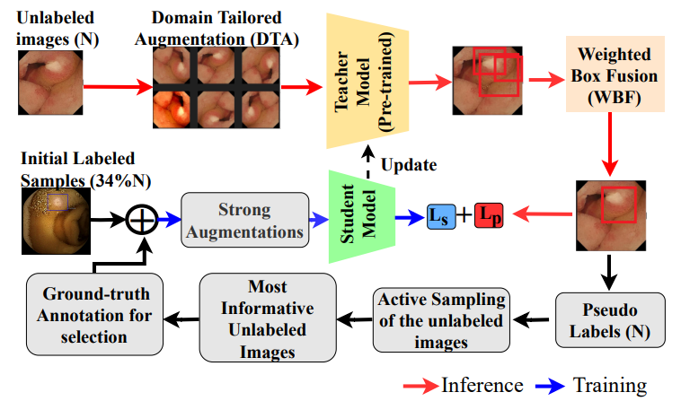
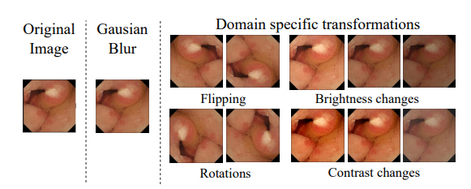
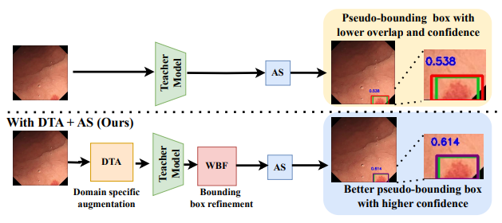

# IMPROVING PSEUDO-LABELS SELECTION USING DOMAIN PRIORS FOR SEMI-SUPERVISED DETECTION IN CAPSULE ENDOSCOPY
This is an official implementation for ICIP2025 paper ["IMPROVING PSEUDO-LABELS SELECTION USING DOMAIN PRIORS FOR SEMI-SUPERVISED DETECTION IN CAPSULE ENDOSCOPY"](https://xxxx.pdf). 

<!-- by [Peng Mi](), [Jianghang Lin](https://github.com/HunterJ-Lin), [Yiyi Zhou](), [Yunhang Shen](), [Gen Luo](), [Xiaoshuai Sun](), [Liujuan Cao](), [Rongrong Fu](), [Qiang Xu](), [Rongrong Ji](). -->
<!-- Conference on Computer Vision and Pattern Recognition (CVPR) 2022 Paper.</br> -->

## Introduction

The overall of our **Bloc Diagram**. 
<p align="center">

</p>

Our Domain-Tailored Augmentations **DTA**. 
<p align="center">

</p>

**Better pseudo-labels than Active Teacher**. 
<p align="center">

</p>

## Important notes
- Update "NUM_CLASSES: 8" in 'configs/coco/Base-RCNN-FPN.yaml' to fit the number of class of your dataset.
- You can also update other parameters in the configuration file 'configs/coco/Base-RCNN-FPN.yaml' or 'configs/Base-RCNN-FPN.yaml'
- Update "metadata" variable in 'tools/train_net.py' and 'tools/train_net_sets.py' according to the classes names of your dataset
  
## Installation

- Install **detectron2** following the [instructions](https://detectron2.readthedocs.io/tutorials/install.html).

## Important notes
- Update "NUM_CLASSES: 8" in 'configs/coco/Base-RCNN-FPN.yaml' to fit the number of class of your dataset.
- You can also update other parameters in the configuration file 'configs/coco/Base-RCNN-FPN.yaml' or 'configs/Base-RCNN-FPN.yaml'
- Update "metadata" variable in 'tools/train_net.py' and 'tools/train_net_sets.py' according to the classes names of your dataset
  
## Dataset Preparation

### Custom dataset
Download our folder containing the two datasets (Kvasir Capsule and SEE-AI) we used here :[Kvasir Capsule](https://www.kaggle.com/datasets/emmanuelagosou/our-samples-from-kvasir-capsule-dataset) and [SEE-AI](https://www.kaggle.com/datasets/emmanuelagosou/our-samples-from-see-ai-datastet)
After downloading extract 
Then, copy the concerned dataset content in the folder "datasets". For testing we provide 9 subsets. The .json files contains the annotations.
The expected files structure is :
### Dataset File structure:
```
datasets/
 coco/
  annotations/
     coco_training.json
     set1_coco_validation.json
     .....
     set9_coco_validation.json
  train/
     images.jpg 
     .....
  val/
     images.jpg
     .....
  valsets/
    set1/
      images.jpg
     .....
    set9/
      images.jpg
```
[Use Custom Datasets](https://detectron2.readthedocs.io/tutorials/datasets.html) gives a deeper dive on how to use `DatasetCatalog` and `MetadataCatalog`, and how to add new datasets to them.

## Training (34.79% label data for example)
### Step 0、Generate 34.79% label data partition
```
python tools/generate_random_data_partition.py --random_file dataseed/COCO_supervision.txt --random_percent 34.79
```

### Step 1、Train a pick model on 34.79% random data
```
mkdir temp
mkdir temp/coco
mkdir results
mkdir results/coco
mkdir dataseed/coco_pick

python tools/train_net.py \
      --num-gpus 1 \
      --config configs/coco/faster_rcnn_R_50_FPN_sup35_run1.yaml \
       SOLVER.IMG_PER_BATCH_LABEL 16 SOLVER.IMG_PER_BATCH_UNLABEL 16  OUTPUT_DIR output/coco/result_initial_faster_rcnn_R_50_FPN_sup35_run1_16bs

```

### Step 2、Use the trained model from step 1 to get the indicator file of the dataset
```
python tools/inference_for_active_pick_TTA_AS.py\
    --static_file temp/coco/static_by_random.json \
    --model_weights output/coco/result_initial_faster_rcnn_R_50_FPN_sup35_run1_16bs/model_best.pth \
    --config configs/coco/faster_rcnn_R_50_FPN_sup35_run1.yaml \
    

python tools/TTA_AS_active_pick_evaluation.py \
    --static_file temp/coco/static_by_random.json/static_by_random.json \
    --indicator_file results/coco/random_maxnorm
    
```

### Step 3、Use the indictor file from step 2 to generate pick data and merge random data
```
python tools/TTA_AS_generate_pick_merge_random_data_partition.py \
    --random_file dataseed/COCO_supervision.txt \
    --random_percent 34.79\
    --indicator_file results/coco/random_maxnorm.txt \
    --pick_percent 35.21\
    --save_file dataseed/coco_pick/pick_maxnorm+random.txt\
    --static_file temp/coco/static_by_random.json/static_by_random.json \
    --reverse True \
```

### Step 4、Train a model from scratch using the 10% data partition from step 3
```
python tools/TTA_SA_GT_train_net.py \
      --num-gpus 1 \
      --config configs/coco/faster_rcnn_R_50_FPN_sup70_run1.yaml \
       SOLVER.IMG_PER_BATCH_LABEL 16 SOLVER.IMG_PER_BATCH_UNLABEL 16 OUTPUT_DIR output/coco/result_final_faster_rcnn_R_50_FPN_sup70_run1_16bs DATALOADER.RANDOM_DATA_SEED_PATH dataseed/coco_pick/pick_maxnorm+random.txt   
  
```

## Evaluation
```
python tools/train_net.py \
      --eval-only \
      --num-gpus 1 \
      --config configs/coco/faster_rcnn_R_50_FPN_sup70_run1.yaml \
       SOLVER.IMG_PER_BATCH_LABEL 16 SOLVER.IMG_PER_BATCH_UNLABEL 16  MODEL.WEIGHTS output/coco/result_final_faster_rcnn_R_50_FPN_sup70_run1_16bs/model_best.pth OUTPUT_DIR output/results

```
## Evaluation for each set :
Note: You should update the "register_coco_instances()" function with the corresponding directions for the images and the annotations .json file of the concerned 'set' in the file  'train_net_sets.py' 
```
python tools/train_net_sets.py \
      --eval-only \
      --num-gpus 1 \
      --config configs/coco/faster_rcnn_R_50_FPN_sup70_run1.yaml \
       SOLVER.IMG_PER_BATCH_LABEL 16 SOLVER.IMG_PER_BATCH_UNLABEL 16  MODEL.WEIGHTS output/coco/result_final_faster_rcnn_R_50_FPN_sup70_run1_16bs/model_best.pth  OUTPUT_DIR output/set_name

```


## Results
- The results on **different datasets** is shown as below:

|                                         | GT      | AS      | Annotation | AP                                 | AP50           | AP75           | APs            | APm            | APl            |
|-----------------------------------------|---------|---------|------------|------------------------------------|----------------|----------------|----------------|----------------|----------------|
|                                         |         |         |            | SEE-AI Dataset |
| Faster RCNN         | 100\%   | --      | --         | 33.60                              | 61.30          | 33.20          | 6.00           | 15.80          | 36.80          |
| Unbiased Teacher  | 34.79\% | --      | 100\% PL   | 30.63                              | 55.92          | 28.81          | 16.79          | 17.37          | 33.72          |
| Active  Teacher      | 34.79\% | 35.21\% | GT         | 38.65                              | 69.91          | 37.89   | 	19.82 | 26.21          | 41.27          |
| DTA + AS (Ours)                         | 34.79\% | 35.21\% | GT         | 40.09                    | 73.00 | 37.44          | 15.98          | 26.89 | 42.34 |
|                                         |         |         |            | Kvasir-Capsule |
| Faster RCNN         | 100\%   | --      | --         | 57.30                              | 81.70          | 65.70          | 23.70          | 49.60          | 61.30          |
| Unbiased Teacher  | 34.79\% | --      | 100\% PL   | 61.35                              | 91.28          | 69.32          | 39.30          | 55.76          | 65.20          |
| Active Teacher       | 34.79\% | 35.21\% | GT         | 63.63                              | 94.02 | 70.95          | 35.33          | 58.84          | 69.62          |
| DTA + AS (Ours)                         | 34.79\% | 35.21\% | GT         | 64.17                    | 93.25          | 74.32 | 43.45 | 58.89 | 70.73 |

## Citing DTA+AS

If you find our work useful in your research, please consider citing:

```
@inproceedings{agossou2025dta,
  title={Improving pseudo-labels selection using domain priors for semi-supervised detection in capsule endoscopy},
  author={Agossou, Bidossessi Emmanuel and Pedersen, Marius and Raja, Kiran and Vats Anuja},
  booktitle={IEEE International Conference on Image Processing [under review]},
  year={2025},
  pages={},
  publisher={IEEE}
}
```

## Acknowledgement
-   [Active teacher](https://github.com/HunterJ-Lin/ActiveTeacher/tree/main)
-   [STAC](https://github.com/google-research/ssl_detection)
-   [unbiased teacher](https://github.com/facebookresearch/unbiased-teacher)
-   [detectron2](https://github.com/facebookresearch/detectron2)
